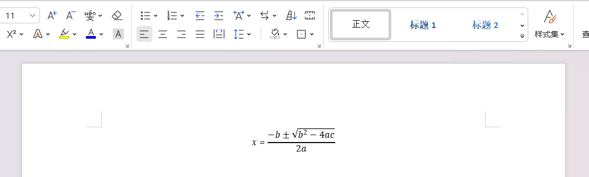

# LatexToWord
A pure python library implemented by python3 for writing Latex formulas to word.


[Readme_CN](https://github.com/Gu-f/LatexToWord/blob/main/README_CN.md)  

## USAGE  
`pip install latex2word`  

```python
from docx import Document
from latex2word import LatexToWordElement

"""
`pip install python-docx`  
常规用法  
General usage.  
"""

# 公式(Latex string)
latex_input = r"x={-b \pm \sqrt{b^2-4ac}\over 2a}"
# 构建latex_to_word对象 (Build latex_to_word objects)
latex_to_word = LatexToWordElement(latex_input)

# 插入word公式(Create the docx file and insert the element)
doc = Document()
paragraph = doc.add_paragraph()
latex_to_word.add_latex_to_paragraph(paragraph)

doc.save('test.docx')
```  
Result:  
  

